# HV_MonitoringScalingAutomation

## Objective
This is a Repository for Graded Assignment on Monitoring, Scaling and Automation

---
## Prerequisites
Web Application code hosted in Github repository --> https://github.com/SyamalaKadmi/HeroViredRepositories.git
## Instructions

---

### 1. Web Application Deployment
1. Boto3 script to create S3 bucket:
   - [S3Creation.py](Scripts/S3Creation.py)
      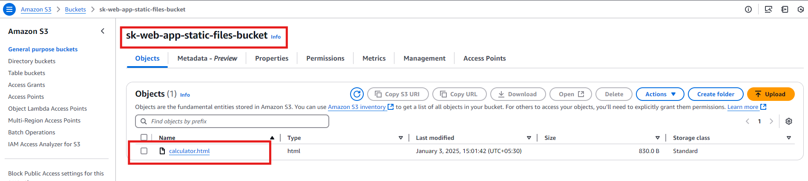
2. Launch an EC2 instance and configure it as a web server & deploy the Application
   - [LaunchEC2Instance.py](Scripts/LaunchEC2Instance.py) 
      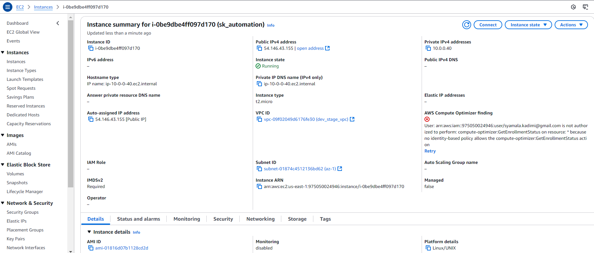
   - Application Deployment
      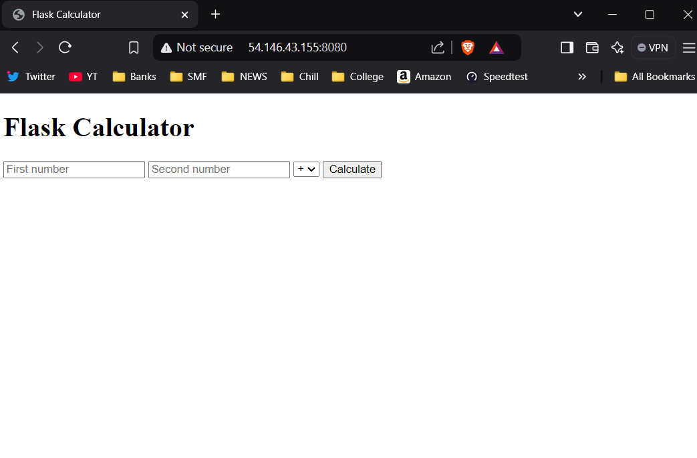

---

### 2. Load Balancing with ELB
1. Deploy an Application Load Balancer (ALB) using `boto3`& Register the EC2 instance(s) with the ALB
   - [loadBalancing.py](Scripts/loadBalancing.py)
      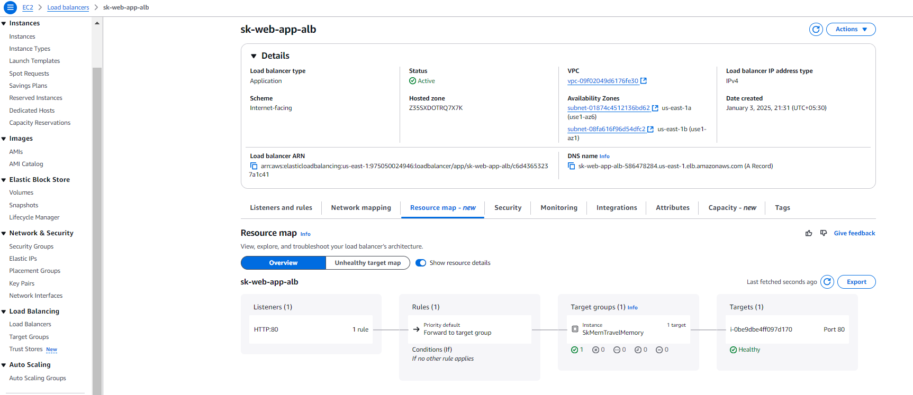

---

### 3. Auto Scaling Group (ASG) Configuration 
1. Using `boto3`, create an ASG with the deployed EC2 instance as a template &  
   Configure scaling policies to scale in/out based on metrics like CPU utilization or network traffic. 
   - [asg.py](Scripts/asg.py)
      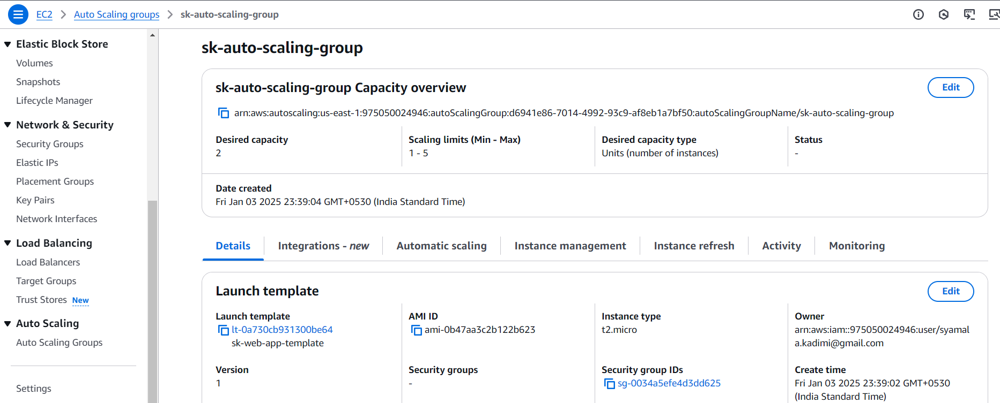 
   - AMI Creation
      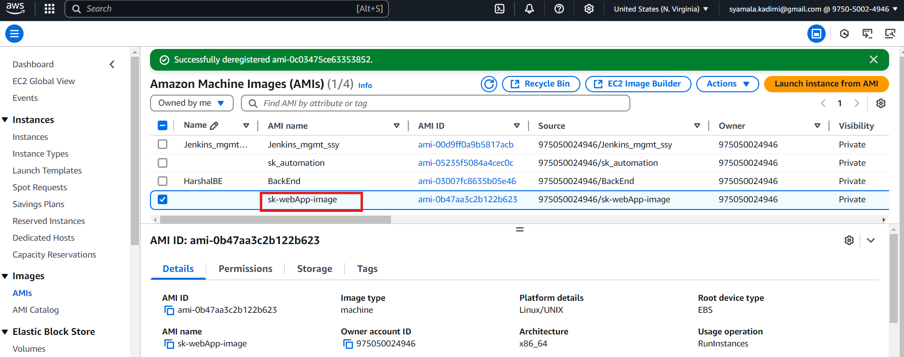
   - Launch template Creation
      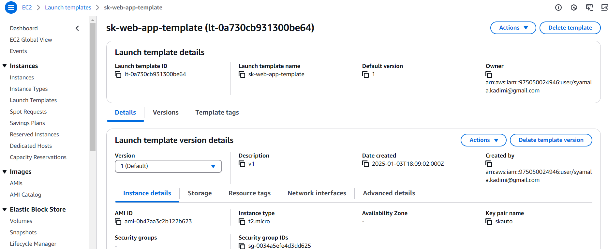

---
   
### 4. SNS Notifications
1. Set up different SNS topics for different alerts (e.g., health issues, scaling events, high traffic) & 
   Integrate SNS with Lambda so that administrators receive SMS or email notifications. 
   - [sns_notifications.py](Scripts/sns_notifications.py)
      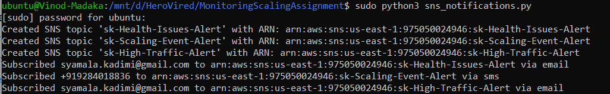 
   - Lambda function Creation
      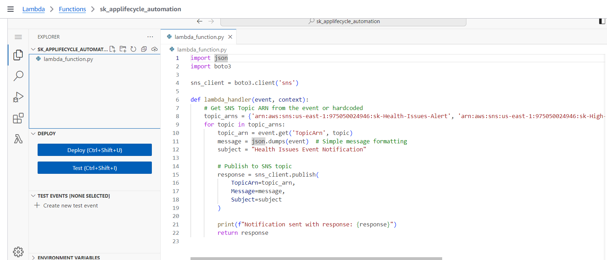
   - SNS subscriptions Creation
      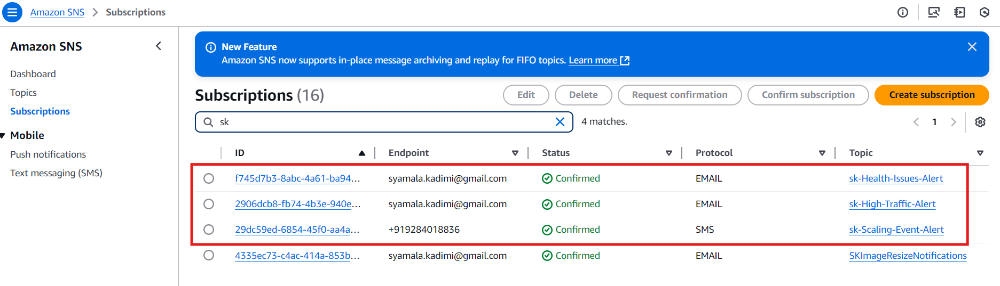
   - SNS topics Creation
      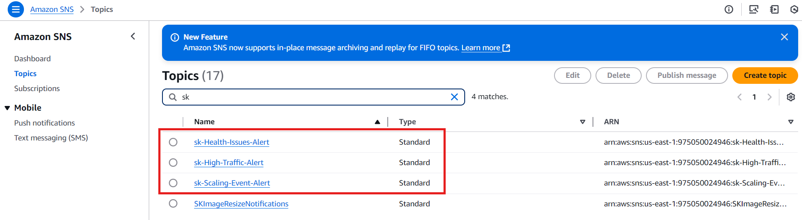
   - CloudWatch events to receive SMS or email notifications
      [CloudWatchEvents](Scripts/CloudWatchEvents.py)
      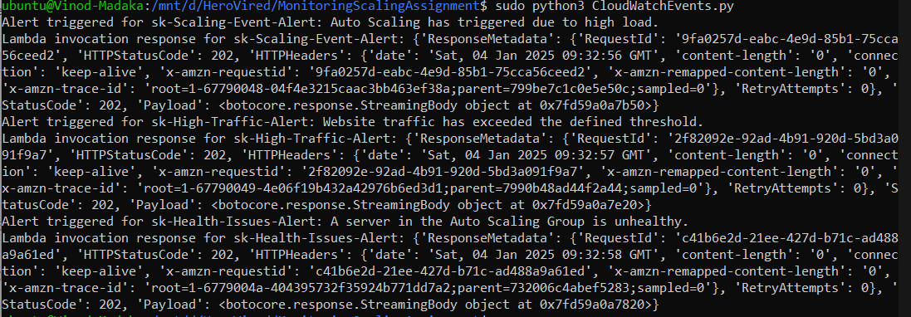
   - Email Notifications
      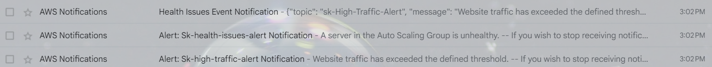

---

### 5. Infrastructure Automation: 

 A single script using `boto3` that
   - Deploys the entire infrastructure. 
   - Updates any component as required. 
   - Tears down everything when the application is no longer needed. 
     - [completeScript.py](Scripts/completeScript.py)

 

